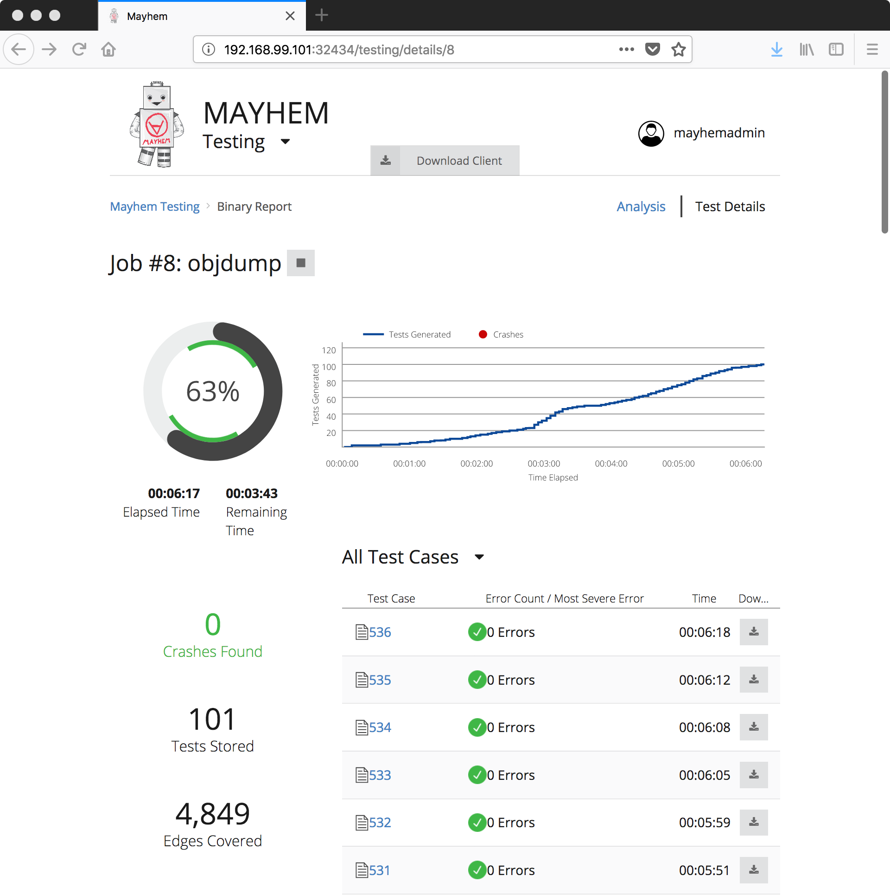

# Packaging and analyzing simple binary executables.

This tutorial is designed to be the first in a series of tutorials on how to use MAYHEM to work with binary applications. In this tutorial, we will cover the six steps to analyzing a binary with MAYHEM:

  1. Confirm that you can run the program on the command line. 
  2. Package up the application Mayhem package /usr/bin/objdump mydir.
  3. Edit configuration to specify the command line you ran
  4. Upload the package to the Mayhem cloud service and start mayhem NOTE: WHERE DO YOU GET THE URL? Mayhem upload mydir —start-sword
  5. Go to the UI and watch Mayhem test the program!
  6. Download test cases

## Basic Vocabulary

We will begin by establishing common vocabulary.

  * **Corpus** - A set of inputs.
  * **Harness** - A harness is a special-purpose program, created to better test code or another application.
  * **Input** - Input refers to data generated by the fuzzer to run within a program. A program may read configuration files, or receive various user inputs, but within the context of fuzzing input refers only to the input generated by the fuzzer and used to test the program. The Input changes each time the fuzzer runs.
  * **Input Source** - The way a program receives the input generated by the fuzzer. For example, this may include reading from a file, or accepting a connection from a network client.
  * **Invoke** - To run a program over a given input.
  * **Program Under Test** - The Program Under Test is the program being tested by the fuzzer.
  * **Program** - Program can refer to a Program Under Test, or harness, depending on context.
  * **Test Case** - A synonym for input.

## Requirements for our binary

In order for our binary to be analyzed with MAYHEM, the following properties must hold:

  * The binary application must accept input through a means supported by MAYHEM.
  * The binary application must run on an architecture and operating system supported by MAYHEM.
  * You are looking for errors in the binary you are testing.

## Packaging `objdump`

`objdump` is an application distributed with GNU binutils to dump and display information about programs stored in common binary executable file formats. We will package `objdump` for MAYHEM, and upload `objdump` to our instance of MAYHEM Sword.

To begin, we will install `objdump`. To do this on a debian-based distro (Debian, Ubuntu, etc.), we run:

    apt-get update && \
    apt-get upgrade -y && \
    apt-get install -y binutils

# Step 1: Run the Program from the Command Line.

We can now run `objdump`, and see what options are available.

```
root@d5ec5618a4ed:~# objdump /bin/ls
Usage: objdump <option(s)> <file(s)>
 Display information from object <file(s)>.
 At least one of the following switches must be given:
  -a, --archive-headers    Display archive header information
  -f, --file-headers       Display the contents of the overall file header
  -p, --private-headers    Display object format specific file header contents
  -P, --private=OPT,OPT... Display object format specific contents
  -h, --[section-]headers  Display the contents of the section headers
  -x, --all-headers        Display the contents of all headers
  -d, --disassemble        Display assembler contents of executable sections
  -D, --disassemble-all    Display assembler contents of all sections
  -S, --source             Intermix source code with disassembly
  -s, --full-contents      Display the full contents of all sections requested
  -g, --debugging          Display debug information in object file
  -e, --debugging-tags     Display debug information using ctags style
  -G, --stabs              Display (in raw form) any STABS info in the file
  -W[lLiaprmfFsoRt] or
  --dwarf[=rawline,=decodedline,=info,=abbrev,=pubnames,=aranges,=macro,=frames,
          =frames-interp,=str,=loc,=Ranges,=pubtypes,
          =gdb_index,=trace_info,=trace_abbrev,=trace_aranges,
          =addr,=cu_index]
                           Display DWARF info in the file
  -t, --syms               Display the contents of the symbol table(s)
  -T, --dynamic-syms       Display the contents of the dynamic symbol table
  -r, --reloc              Display the relocation entries in the file
  -R, --dynamic-reloc      Display the dynamic relocation entries in the file
  @<file>                  Read options from <file>
  -v, --version            Display this program's version number
  -i, --info               List object formats and architectures supported
  -H, --help               Display this information
root@d5ec5618a4ed:~# 
```

Running with no flags isn't very helpful. If we take a look at the help menu that's printed out, we see there's a variety of flags printed out. The flags `-x` and `-D` look useful. Let's try running again with those flags.

```
root@d5ec5618a4ed:~# objdump -xD /bin/ls | head

/bin/ls:     file format elf64-x86-64
/bin/ls
architecture: i386:x86-64, flags 0x00000150:
HAS_SYMS, DYNAMIC, D_PAGED
start address 0x0000000000005430

Program Header:
    PHDR off    0x0000000000000040 vaddr 0x0000000000000040 paddr 0x0000000000000040 align 2**3
         filesz 0x00000000000001f8 memsz 0x00000000000001f8 flags r-x
         
...
         
  1a:   66 61                   data16 (bad) 
  1c:   61                      (bad)  
  1d:   35 62 64 31 30          xor    $0x30316462,%eax
  22:   65 63 63 64             movslq %gs:0x64(%rbx),%esp
  26:   2e 64 65 62             cs fs gs (bad) {%k6}
  2a:   75 67                   jne    93 <_init@@Base-0x3435>
  2c:   00 00                   add    %al,(%rax)
  2e:   00 00                   add    %al,(%rax)
  30:   c2 01 46                retq   $0x4601
  33:   f8                      clc    
root@d5ec5618a4ed:~# 
```

Terrific. Now we know exactly how we want to invoke `objdump`, with the `-xD` flags.

# Step 2: Package the Application.

To package this binary, we run `mayhem package /usr/bin/objdump`. Let's try that out now.

```
root@d5ec5618a4ed:~# mayhem package /usr/bin/objdump
INFO:root:Packaging application: /usr/bin/objdump
INFO:root:Packaging dependency: /usr/bin/objdump -> /tmp/objdump-wng7lsdf/root/usr/bin/objdump
INFO:root:Packaging dependency: /lib/x86_64-linux-gnu/libz.so.1 -> /tmp/objdump-wng7lsdf/root/lib/x86_64-linux-gnu/libz.so.1
INFO:root:Packaging dependency: /usr/lib/x86_64-linux-gnu/libopcodes-2.28-system.so -> /tmp/objdump-wng7lsdf/root/usr/lib/x86_64-linux-gnu/libopcodes-2.28-system.so
INFO:root:Packaging dependency: /usr/lib/x86_64-linux-gnu/libbfd-2.28-system.so -> /tmp/objdump-wng7lsdf/root/usr/lib/x86_64-linux-gnu/libbfd-2.28-system.so
INFO:root:Generating default configuration under: /tmp/objdump-wng7lsdf/config.json
INFO:root:Packaged /usr/bin/objdump under: /tmp/objdump-wng7lsdf
root@d5ec5618a4ed:~# 
```

# Step 3: Edit the Configuration.

There are a few files and folders inside the package we have created at `/tmp/objdump-wng7lsdf`.

```
root@d5ec5618a4ed:~# ls -lh /tmp/objdump-wng7lsdf
total 12K
-rw-r--r-- 1 root root  277 Jul  9 20:45 config.json
drwxr-xr-x 2 root root 4.0K Jul  9 20:45 corpus
drwxr-xr-x 4 root root 4.0K Jul  9 20:45 root
```

The `corpus` directory contains seed inputs. Earlier, when we talked about mutation-based input generation, these are the inputs that MAYHEM would mutate. Fortunate for us, objdump parses linux executables, and we have plenty of those right in our example VM. Let's copy a couple over to the corpus directory.

```
~# cp /bin/pwd /tmp/objdump-wng7lsdf/corpus/
~# cp /bin/true /tmp/objdump-wng7lsdf/corpus/
~# cp /bin/cat /tmp/objdump-wng7lsdf/corpus/
```

The root directory contains all of the files and dependencies required for MAYHEM to invoke and run the binary we wish to test. This directory has been auto-populated with the dynamically-linked runtime dependencies for us.

The `config.json` file contains auto-populated configuration information for MAYHEM, informing MAYHEM how to invoke and run our binary under test.

We do need to modify the `config.json` file. Let's take a look at what's inside first.

```
root@d5ec5618a4ed:~# cat /tmp/objdump-wng7lsdf/config.json 
{
    "fuzzers": [
        {
            "target_args": [
                "@@"
            ],
            "library_path": "root/usr/lib/x86_64-linux-gnu:root/lib/x86_64-linux-gnu",
            "target": "root/usr/bin/objdump"
        }
    ]
}
```

For the purposes of this tutorial, we are only concerned with the `"target_args"` field. This is a json array of command-line arguments to be passed to the target binary. `"@@"` is a special argument that tells MAYHEM, "Create an input filename for me, and place it here." We want to pass the command line argument `-xD` before `@@`, so we will change `"target_args"` to look like this:

```
            "target_args": [
                "-xD",
                ""@@"
            ]
```
The `"target"` field tells MAYHEM where the target binary is located inside the configuration package.
The `"library_path"` field tells MAYHM where the library dependencies are located for the target. 
Both of these are automatically populated by the `mayhem package` command. 
It is important to note that any extra files required to be packaged along with the binary (e.g. configuration files), must be placed in root. 

# Step 4: Upload the Application.

We're now going to upload this package to MAYHEM. We need the URL for the running instance of MAYHEM we wish to upload this package to. For me, this URL is `http://192.168.99.101:32434`.

To upload, I will type:

    mayhem upload --start-sword -u http://192.168.99.101:32434/ /tmp/objdump-wng7lsdf --duration 300

`--start-sword` tells MAYHEM to start fuzzing as soon as the binary is uploaded, and `-u` allows us to specify a URL to our specific instance of MAYHEM.
`--duration` specifies the number of seconds to run the analysis for.

# Step 5: Observe MAYHEM Running in the User Interface.

We can now browse to http://192.168.99.101:32434, or whatever your specific url is, and watch MAYHEM starting to analyze our binary.



# Step 6: Download Testcases

After a while, we may decide we want to download some testcases. Mayhem makes this easy. We find the job number in the user interface, and then run:

```
root@722c14ef332a:~# mayhem testsuite download 1
INFO:root:Downloaded testcase: /tmp/testsuite-zhuxk3_7/.meta/crashes/test-14
INFO:root:Downloaded testcase: /tmp/testsuite-zhuxk3_7/test-13
INFO:root:Downloaded testcase: /tmp/testsuite-zhuxk3_7/test-10
INFO:root:Downloaded testcase: /tmp/testsuite-zhuxk3_7/test-11
INFO:root:Downloaded testcase: /tmp/testsuite-zhuxk3_7/test-12
INFO:root:Downloaded testcase: /tmp/testsuite-zhuxk3_7/test-12
INFO:root:Downloaded testcase: /tmp/testsuite-zhuxk3_7/test-11
INFO:root:Downloaded testcase: /tmp/testsuite-zhuxk3_7/test-10
INFO:root:Downloaded 8 testcases
INFO:root:Suite downloaded
root@722c14ef332a:~# 
```

If MAYHEM finds a crashing input, you should be able to reproduce the crash.

```
root@722c14ef332a:~# objdump -xD /tmp/testsuite-zhuxk3_7/.meta/crashes/test-14 
Segmentation fault
```
