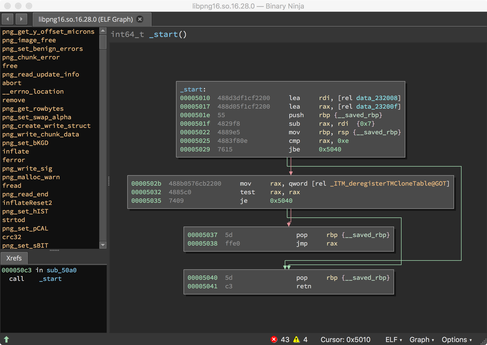
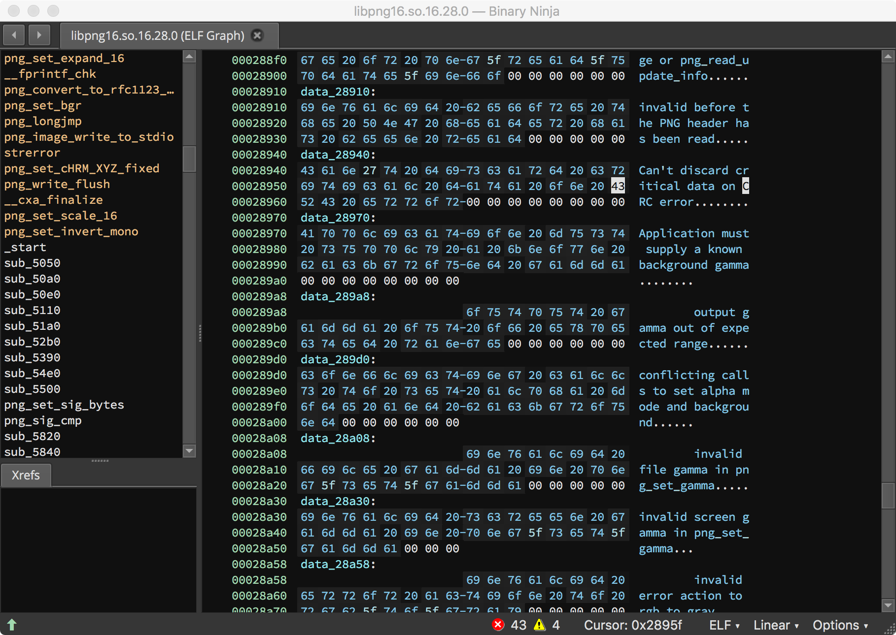
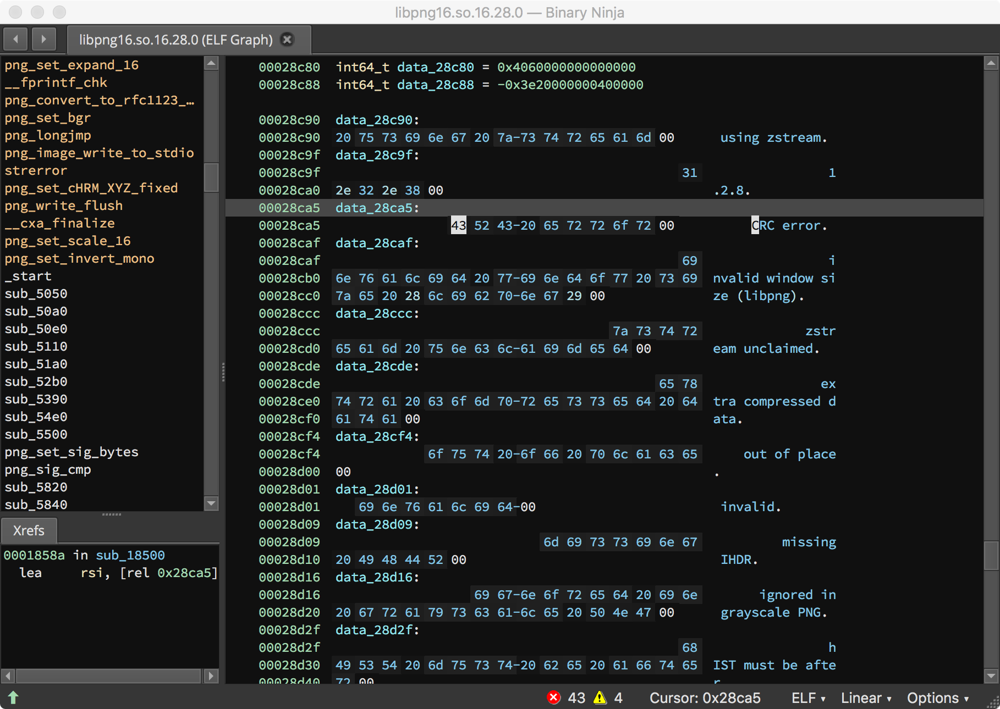
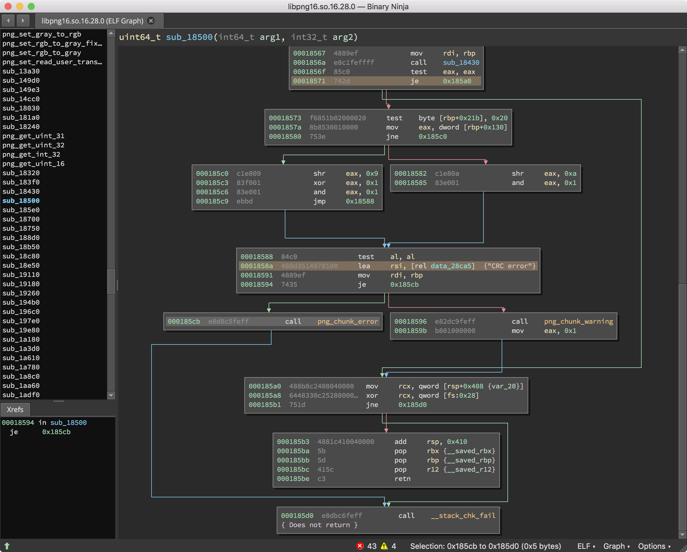
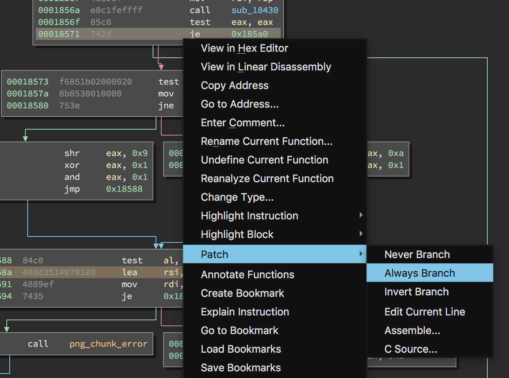
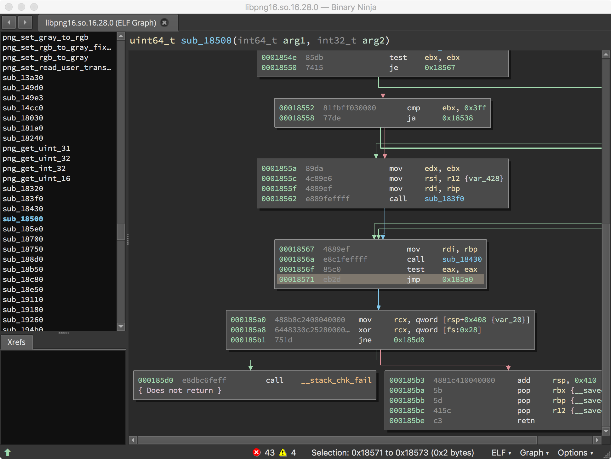

# Patching binaries to improve fuzzing.

In this tutorial, we will learn how to modify binary applications to improve the fuzzing process. If source code is available, there is never a reason to modify a binary. Make the necessary changes in source, and recompile your binary for testing.

When testing of 3rd-party, or legacy applications, is required, source code may not be available. Binary patching can be used to improve the speed and efficiency of testing these programs with MAYHEM.

## Requirements

For this tutorial, you will need
  * Reverse-engineering expertise. This is an advanced tutorial, and you should be comfortable with assembly-level code.
  * A disassembler with the ability to patch instructions. We will be using [Binary Ninja](https://binary.ninja).
  * A hex editor. We will be using [Hex Fiend](https://ridiculousfish.com/hexfiend/), a free hex editor for Mac OS X.

## Why patch binaries

Binary modification is not required for fuzzing, but there are several reasons why vulnerability researchers sometimes modify binaries. Some example reasons:

* Allow a program to cleanly exit after running a single testcase.
* Remove checksum checks that some input-generation tools are not aware of.
* Remove cryptographic primitives from a binary.
* Remove irritating program behaviors that disrupt fuzzing.

In general, we want to remove checks that an attacker can create themselves, but will cause a program to exit before exercising code paths. A common example is a checksum over an incoming data stream.

### A Checksum Story

Assume we have a program with a simple input schema, a 32-bit length field, followed by data, and terminated with a 32-bit crc32 over the length and data fields. Everytime the crc32 is incorrect, our fuzzing target will dismiss the data and throw it out. We know if the program processes the data, and a bug is triggered, an attacker can simply go back and fill in the correct checksum. The checksum doesn't prevent an attacker from providing malicious data.

If we want to get the most use out of MAYHEM, we need to account for this checksum during our testing process. Otherwise, each time MAYHEM generates a testcase with a bad checksum, it will be thrown out. There are two basic ways to account for this checksum:

1. We can pass our inputs through a harness, which will ensure proper checksums are in place before passing those inputs to the program under test.
2. We can patch the binary so that it accepts all inputs, even those with invalid checksums.

We will explore the second option in this tutorial.

### A Fork Story

Programs that fork can sometimes prove troublesome for fuzzing. MAYHEM is intelligent enough to handle programs that fork automatically, but there may come a time where a specific program behavior needs to be removed to improve fuzzing performance.

We will also look at a server application that forks, and remove the fork to improve fuzzing performance.

## Examples

We will be using freely available, opensource applications in our examples. Source code is available for these applications, but we will be approaching these applications from a binary-only perspective.

### Imagemagick PNG fuzzing

In this example, we are going to fuzz png parsing in a popular command-line image-manipulation program called "imagemagick".

Let's start from a fresh Debian Stretch linux environment, and install imagemagick directly from the package repositories.

    apt-get update && \
    apt-get dist-upgrade -y && \
    apt-get install -y imagemagick

And let's run imagemagick over an image:

    $ convert /tutorials/binary-patching/imagemagic/nsa-insignia-sm.png -enhance /tutorials/binary-patching/imagemagic/enhanced.png
    $

Perfect!

Now, knowing that the PNG file format uses crc checksums, I've created a modified PNG which causes imagemagic to print out failed checksum errors. I did this by running [radamda](https://github.com/aoh/radamsa) over our `nsa-insignia-sm.png` file, and testing the output until I had a new PNG that gave an error for invalid checksum.

    root@a67f5575a117:~# convert /tutorials/binary-patching/imagemagic/nsa-insignia-crc-error.png /tmp/out.png
    convert-im6.q16: IDAT: CRC error `/tutorials/binary-patching/imagemagic/nsa-insignia-crc-error.png' @ error/png.c/MagickPNGErrorHandler/1628.
    root@a67f5575a117:~# 

Perfect!

There are a couple ways we can move forward with patching this checksum. We can:

  * Search for magic numbers associated with the algorithm we are trying to modify, and work backwards to see where the output of that algorithm is verified against out input.
  * Use the strings in the error message to find the relevant code.
  * Reverse-engineer the binary until we find the correct place to patch.

Let's take a look at this string, and see if we can find out how to patch around this crc check.

We'll start by using our good friend `grep` to find the string "CRC error".

  root@a67f5575a117:~# grep "CRC error" /usr/bin/convert
  root@a67f5575a117:~# 

Not in the convert binary... Let's take a look at the dependencies.

    root@a67f5575a117:~# ldd /usr/bin/convert
    linux-vdso.so.1 (0x00007ffec85d3000)
    libMagickCore-6.Q16.so.3 => /usr/lib/x86_64-linux-gnu/libMagickCore-6.Q16.so.3 (0x00007f2a0215a000)
    libMagickWand-6.Q16.so.3 => /usr/lib/x86_64-linux-gnu/libMagickWand-6.Q16.so.3 (0x00007f2a01e31000)
    libpthread.so.0 => /lib/x86_64-linux-gnu/libpthread.so.0 (0x00007f2a01c14000)
    libc.so.6 => /lib/x86_64-linux-gnu/libc.so.6 (0x00007f2a01875000)
    liblcms2.so.2 => /usr/lib/x86_64-linux-gnu/liblcms2.so.2 (0x00007f2a01619000)
    liblqr-1.so.0 => /usr/lib/x86_64-linux-gnu/liblqr-1.so.0 (0x00007f2a01401000)
    libfftw3.so.3 => /usr/lib/x86_64-linux-gnu/libfftw3.so.3 (0x00007f2a01004000)
    libfontconfig.so.1 => /usr/lib/x86_64-linux-gnu/libfontconfig.so.1 (0x00007f2a00dc6000)
    libfreetype.so.6 => /usr/lib/x86_64-linux-gnu/libfreetype.so.6 (0x00007f2a00b17000)
    libXext.so.6 => /usr/lib/x86_64-linux-gnu/libXext.so.6 (0x00007f2a00905000)
    libX11.so.6 => /usr/lib/x86_64-linux-gnu/libX11.so.6 (0x00007f2a005c5000)
    libbz2.so.1.0 => /lib/x86_64-linux-gnu/libbz2.so.1.0 (0x00007f2a003b5000)
    libz.so.1 => /lib/x86_64-linux-gnu/libz.so.1 (0x00007f2a0019b000)
    libltdl.so.7 => /usr/lib/x86_64-linux-gnu/libltdl.so.7 (0x00007f29fff91000)
    libm.so.6 => /lib/x86_64-linux-gnu/libm.so.6 (0x00007f29ffc8d000)
    libgomp.so.1 => /usr/lib/x86_64-linux-gnu/libgomp.so.1 (0x00007f29ffa60000)
    libgcc_s.so.1 => /lib/x86_64-linux-gnu/libgcc_s.so.1 (0x00007f29ff849000)
    /lib64/ld-linux-x86-64.so.2 (0x00007f2a02828000)
    libglib-2.0.so.0 => /lib/x86_64-linux-gnu/libglib-2.0.so.0 (0x00007f29ff535000)
    libexpat.so.1 => /lib/x86_64-linux-gnu/libexpat.so.1 (0x00007f29ff30b000)
    libpng16.so.16 => /usr/lib/x86_64-linux-gnu/libpng16.so.16 (0x00007f29ff0d8000)
    libxcb.so.1 => /usr/lib/x86_64-linux-gnu/libxcb.so.1 (0x00007f29feeb0000)
    libdl.so.2 => /lib/x86_64-linux-gnu/libdl.so.2 (0x00007f29fecac000)
    libpcre.so.3 => /lib/x86_64-linux-gnu/libpcre.so.3 (0x00007f29fea39000)
    libXau.so.6 => /usr/lib/x86_64-linux-gnu/libXau.so.6 (0x00007f29fe835000)
    libXdmcp.so.6 => /usr/lib/x86_64-linux-gnu/libXdmcp.so.6 (0x00007f29fe62f000)
    libbsd.so.0 => /lib/x86_64-linux-gnu/libbsd.so.0 (0x00007f29fe419000)
    librt.so.1 => /lib/x86_64-linux-gnu/librt.so.1 (0x00007f29fe211000)

Some of these look promising.

    root@a67f5575a117:~# grep "CRC error" /usr/lib/x86_64-linux-gnu/*                       
    ...
    Binary file /usr/lib/x86_64-linux-gnu/libpng16.so.16 matches
    Binary file /usr/lib/x86_64-linux-gnu/libpng16.so.16.28.0 matches
    ...

Easy, we need to patch `libpng16.so.16.28.0`. Your linux distribution may have a different version of libpng, but you should be fine to play along with whichever version you have.

Let's open `libpng16.so.16.28.0` in Binary Ninja.

We'll search for the string "CRC error".

The first entry finds the subtstring "CRC error" in the middle of another string. This is probably not what we want.

The next entry gives us the "CRC error" string alone. And we have a cross-reference to `0x1858a`! This looks promising.

A quick look at this function shows our `"CRC error"` string being loaded immediately prior to a call to `png_chunk_error` or `png_chunk_warn`. We hope all we need to do is avoid the blocks which drive us over `png_chunk_error` and `png_chunk_warn`. If we can always take the branch at `0x18571`, hopefully we can avoid `libpng` dying on checksum errors, and we will be able to more efficiently fuzz imagemagick.

Binary Ninja makes this process easy for us. We right-click the instruction at 0x18571, and select `Patch -> Always Branch`.

When we're done, the program should never execute the code taken to trigger an error or warning on a checksum mismatch. Our function now looks as follows:

In Binary Ninja, go to `File -> Save Contents As`, and save your new `lbpng.so.16.28.0`. We'll make sure that overwrites the original `libpng.so`, and rerun our convert program.

    root@a67f5575a117:~# convert /tutorials/binary-patching/imagemagic/nsa-insignia-crc-error.png /tmp/out.png
    convert-im6.q16: IDAT: CRC error `/tutorials/binary-patching/imagemagic/nsa-insignia-crc-error.png' @ error/png.c/MagickPNGErrorHandler/1628.
    root@a67f5575a117:~# cp /tutorials/binary-patching/imagemagic/libpng16.so.16.28.0.patched /usr/lib/x86_64-linux-gnu/libpng16.so.16.28.0 
    root@a67f5575a117:~# convert /tutorials/binary-patching/imagemagic/nsa-insignia-crc-error.png /tmp/out.png
    convert-im6.q16: PNG unsigned integer out of range `/tutorials/binary-patching/imagemagic/nsa-insignia-crc-error.png' @ error/png.c/MagickPNGErrorHandler/1628.

Perfect! Now we don't have to worry about imagemagick throwing out inputs just because they have incorrect checksums. We can go ahead and package up this binary, and send it off to MAYHEM for analysis.

    root@a67f5575a117:~# mayhem package /usr/bin/convert -o convert
    INFO:mayhem.mdbclient.commands.package:Packaging application: /usr/bin/convert
    INFO:mayhem.mdbclient.commands.package:Packaging dependency: /usr/bin/convert -> convert/root/usr/bin/convert
    INFO:mayhem.mdbclient.commands.package:Packaging dependency: /usr/lib/x86_64-linux-gnu/libMagickWand-6.Q16.so.3 -> convert/root/usr/lib/x86_64-linux-gnu/libMagickWand-6.Q16.so.3
    INFO:mayhem.mdbclient.commands.package:Packaging dependency: /usr/lib/x86_64-linux-gnu/libMagickCore-6.Q16.so.3 -> convert/root/usr/lib/x86_64-linux-gnu/libMagickCore-6.Q16.so.3
    ...
    INFO:mayhem.mdbclient.commands.package:Packaging dependency: /lib/x86_64-linux-gnu/libpcre.so.3 -> convert/root/lib/x86_64-linux-gnu/libpcre.so.3
    INFO:mayhem.mdbclient.commands.package:Packaging dependency: /lib/x86_64-linux-gnu/libbsd.so.0 -> convert/root/lib/x86_64-linux-gnu/libbsd.so.0
    INFO:mayhem.mdbclient.commands.package:Generating default configuration under: convert/config.json
    INFO:mayhem.mdbclient.commands.package:Packaged /usr/bin/convert under: convert
    root@a67f5575a117:~#
    
We need to adjust the commandline for `convert` a bit, so open up `convert/config.json` with your favorite text editor, and change:

    "target_args": [
        "@@"
    ]

to

    "target_args": [
        "@@",
        "/dev/null"
    ]

All that's left is uploading the package to MAYHEM!

    root@a67f5575a117:~# mayhem upload -u http://192.168.99.100:30128/ --start-sword convert
    WARNING:mayhem.mdbclient.client:Using local environment to figure out the image
    INFO:mayhem.mdbclient.commands.upload:Application successfully uploaded: 1 with harness 1
    INFO:mayhem.mdbclient.commands.upload:Default job added (job_id: 1). Use that job_id to post results to the API.